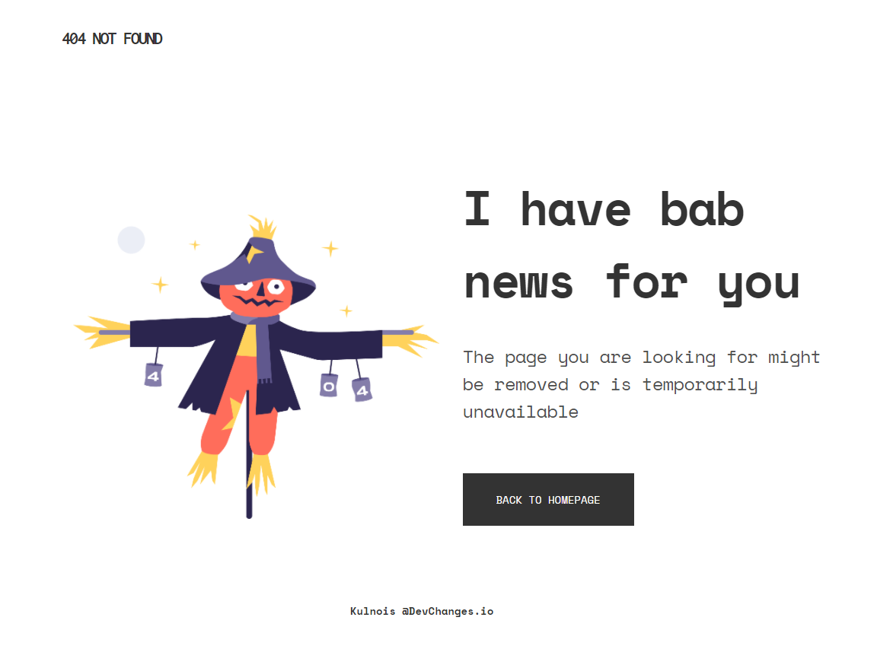
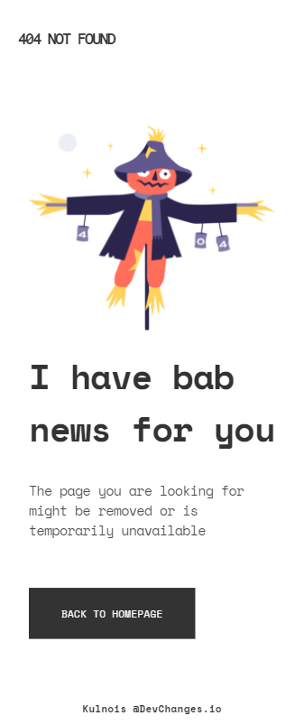

<h1 align="center">404-not-found</h1>

   Solution for a challenge from  <a href="http://devchallenges.io" target="_blank">Devchallenges.io</a>.

  <h3>
    <a href="https://kulnois.github.io/404-not-found-challenge">
      Demo
    </a>
     | 
    <a href="https://kulnois.github.io/404-not-found-challenge">
      Solution
    </a>
     | 
    <a href="https://devchallenges.io/challenges/wBunSb7FPrIepJZAg0sY">
      Challenge
    </a>
  </h3>

## Contact

- Website [kulnois.com](https://kulnois.com)
- GitHub [@kulnois](https://github.com/kulnois)
- Twitter [@kulnois](https://twitter.com/kulnois)
